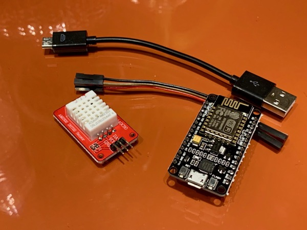

[](https://npmjs.org/package/homebridge-mcuiot)



<!--ts-->
   * [Introduction](#introduction)
   * [Homekit Accessories Created](#homekit-accessories-created)
   * [Installation](#installation)
   * [Nodemcu Device build](#nodemcu-device-build)
   * [Device management](#device-management)
      * [Adding devices](#adding-devices)
      * [Removing devices](#removing-devices)
   * [Configuration](#configuration)
      * [Optional parameters](#optional-parameters)
   * [Optional - Enable access to Google to log data and store graphing data](#optional---enable-access-to-google-to-log-data-and-store-graphing-data)
   * [Credits](#credits)

<!-- Added by: sgracey, at:  -->

<!--te-->

# Introduction

This is a homebridge platform plugin, supporting multiple ESP8266 / nodemcu device's
configured as remote sensor module.  Supported sensor's include DHT22, BME280
and YL-69 Soil Moisture Sensor.  Included is also monitoring of a garage door position
sensor. Also supports auto device discovery using mDNS,
removing the need to manage devices via the config.json file. Historical display of temperature data is available via HomeKit apps thats support graphing.

Full build instructions are here in the [Wiki](./wiki/Instructions-for-Beginners)

Also the YL-69 Moisture sensor will create a phantom "Leak Sensor", and will
trigger a Leak event when the amount of moisture detected crosses a defined threshold.

# Homekit Accessories Created
- DHT - Combination Temperature / Humidity Sensor
- BME - Combination Temperature / Humidity / Barometric Pressure Sensor
- YL - Water Leak Sensor
- GD - Garage Door Opener - Only reporting on position
- BAT - Reads ADC pin, and displays as a battery level

# Installation

1. Install homebridge using: npm install -g homebridge
2. Install homebridge-mcuiot using: npm install -g homebridge-mcuiot
3. Update your configuration file, see sample-config.json in this directory.
4. Install nodemcu-dht-yl69-mdns on your Nodemcu devices, and connect a DHT22 or BME280
Temperature/Humidity and YL-69 Soil Moisture sensors.  See
https://github.com/NorthernMan54/homebridge-mcuiot/tree/master/nodemcu for details on the
NodeMCU build and configuration.

# Nodemcu Device build

See
https://github.com/NorthernMan54/homebridge-mcuiot/tree/master/nodemcu for details on the
NodeMCU build and configuration.

# Device management

## Adding devices

Devices are auto discovered using mDNS, and will add new devices when they appear
on mDNS.  In the event that devices are not discovered, restarting homebridge will
trigger a reconciliation between the plugin and mDNS, and add missing devices.
Missing devices are not removed during startup, see below for how to remove non-existent
devices.

## Removing devices

Devices are removed using the 'Identify Accessory' function.  When you use the
function from your app, it checks to see if the device is truly not responding
then removes the device.  The identity function is not available in the Home app, but in others.

# Configuration

```

    "bridge": {
        "name": "Bart",
        "username": "CC:22:3D:E3:CD:39",
        "port": 51826,
        "pin": "031-45-154"
    },

    "description": "HomeBridge",

"platforms": [
	{ "platform":	"mcuiot",
    "name":     "MCUIOT",
    "debug":    false,
    "aliases": {
      "NODE-2BA4CB": "Front Porch",
      "NODE-8F8FE": "Cold Cellar",
      "NODE-DC4492": "Office",
      "NODE-DC4492GD": "Garage Door"
    } }
	 ],

"accessories": [ ]

}
```
## Optional parameters

- refresh - Refresh rate in seconds for data, defaults to 60 seconds
- leak - Threshold for Moisture sensor to trigger leak detected, defaults to 10%
- port - Optional, port of web server to monitor devices, defaults to 8080
- battery - Optional - BAT, percentage to set battery low alert based on reading of ADC pin.
- storage - Storage of chart graphing data for history graphing, either fs or googleDrive, defaults to fs
- spreadsheetId ( optional ): Log data to a google sheet, this is part of the URL of your spreadsheet.  ie the spreadsheet ID in the URL https://docs.google.com/spreadsheets/d/abc1234567/edit#gid=0 is "abc1234567".
- aliases - Friendly names for your nodemcu's
- debug - Enable debug logging ( This is the same as enabling via command line DEBUG=MCUIOT homebridge)

# Optional - Enable access to Google to log data and store graphing data

This presumes you already have a google account, and have access to google drive/sheets already

Step 1: Turn on the Drive API
a. Use this wizard ( https://console.developers.google.com/start/api?id=sheets.googleapis.com )
to create or select a project in the Google Developers Console and automatically turn on the API. Click Continue, then Go to credentials.

b. On the Add credentials to your project page, click the Cancel button.

c. At the top of the page, select the OAuth consent screen tab. Select an Email address, enter a Product name if not already set, and click the Save button.  I used 'Sheets Data Logger'

d. Select the Credentials tab, click the Create credentials button and select OAuth client ID.

e. Select the application type Other, enter the name "Drive API Quickstart", and click the Create button.

f. Click OK to dismiss the resulting dialog.

g. Click the file_download (Download JSON) button to the right of the client ID.

h. Move this file to your .homebridge and rename it logger_client_secret.json.

Step 2: Authorize your computer to access your Drive Account

a. Change to the directory where the plugin is installed i.e.

cd /usr/lib/node_modules/homebridge-mcuiot/node_modules/mcuiot-logger

b. Run the authorization module

node quickstart.js

c. Browse to the provided URL in your web browser.

If you are not already logged into your Google account, you will be prompted to log in. If you are logged into multiple Google accounts, you will be asked to select one account to use for the authorization.

d. Click the Accept button.

e. Copy the code you're given, paste it into the command-line prompt, and press Enter.


# Credits

* Homebridge communityTypes - Homespun and SphtKr
* simont77 - History Service
* agruen - Simplified setup / installation instructions
