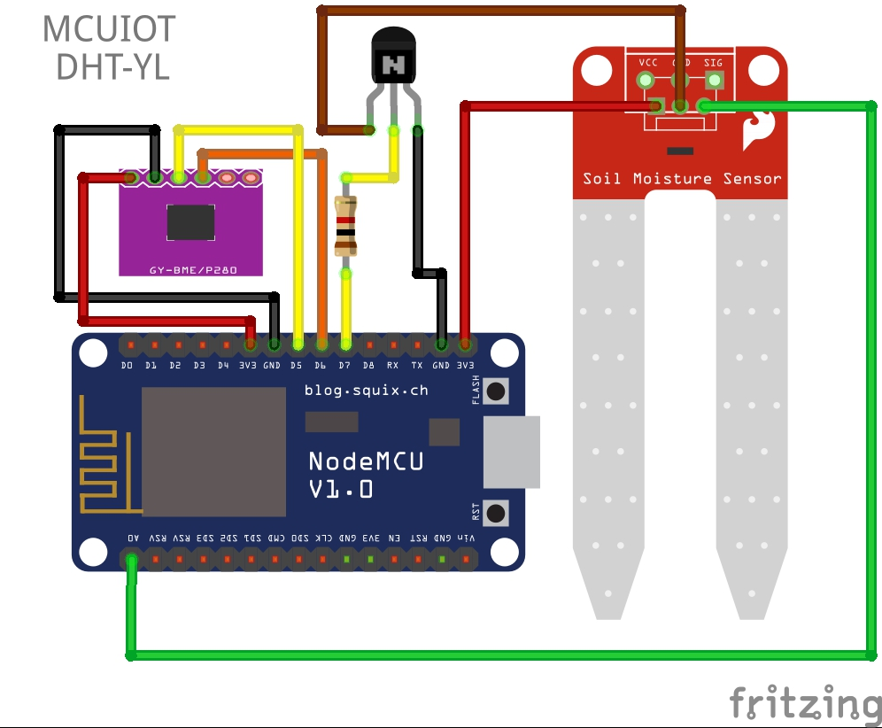

# homebridge-mcuiot ESP8266 LUA Code

LUA programs for a ESP8266/nodeMCU device to read various sensors and integrate into homebridge-mcuiot.  Sensors supported are DHT22 Temperature and Humidity Sensor, Bosch BME280 Temperatue, Humidty and Barometric and the YL-69 Soil Moisture Sensor.  Runs as a simple web server, that responds with sensor data formatted in JSON. Device discovery is done via MDNS, and advertises itself as a dht22 service.

JSON Response looks like this

{ "Hostname": "NODE-871ED8", "Model": "DHT", "Version": "1.1", "Data": {"Temperature": 23.7, "Humidity": 51.8, "Moisture": 1, "Status": 0 }}

or for a BME280

{ "Hostname": "NODE-8689D", "Model": "BME", "Version": "1.2", "Data": {"Temperature": 22.97, "Humidity": 48.341, "Moisture": 8, "Status": 0, "Barometer": 1008.512, "Dew": 11.49 }}

# Hardware

1. Bill of materials
   - nodeMCU / esp8266 dev kit
   - dht22 Temperature / Humidity Sensor
	Or
   - BME280 Bosch DIGITAL HUMIDITY, PRESSURE AND TEMPERATURE SENSOR
   - YL-69 Soil Moisture Sensor
   - 2N3904 Transistor
   - 1K Resister
   - ( Transistor and Resister only needed for Soil Moisture Sensor )

http://www.schematics.com/editor/nodemcu-dht22-yl-69-35878/

# Circuit Diagrams

## DHT-YL


## BME-YL




# nodeMCU Firmware

1. Using http://nodemcu-build.com, create a custom firmware containing at least
   these modules:

   adc,bit,bme280,dht,file,gpio,i2c,mdns,net,node,tmr,uart,websocket,wifi

2. Please use esptool to install the float firmware onto your nodemcu.  There are alot of guides for this, so I won't repeat it here.

# Configuration

1. WIFI Setup - Copy passwords_sample.lua to passwords.lua and add your wifi SSID and passwords.  Please note
   that the configuration supports multiple wifi networks, one per config line.
   ```
   module.SSID["SSID1"] = { ssid="SSID1", pwd = "password" }
   ```

2. Model - Used to determine which sensors are attached ( BME, DHT, YL, or GD)
   ```
   module.Model = "DHT"
   or
   module.Model = "DHT-YL"
   or
   module.Model = "BME"
   or
   module.Model = "BME-GD"
   ```

3. In config.lua update sensor configurations if required.

# Lua Program installation

1. Please use ESPlorer to install the lua files on the device.

```
led.lua                   - Required
main.lua                  - Required
passwords.lua             - Required
config.lua                - Required
setup.lua                 - Required
test.lua                  - Required ( install last )

init.lua                  - Only install after completing initial tests

bme.lua                   - Only required for the BME 280 Sensor

GarageDoorOpenSensor.lua  - Only required for the Garage Door Monitor
ads1115.lua               - Only required for the Garage Door Monitor

README.md                 - Do not install
nodeMCU-DHT22-YL-69.png   - Do not install
bmetest.lua               - Do not install
passwords_sample.lua      - Do not install
```

2. Reboot your device

3. Output from boot via the serial console should look like this.

```
NodeMCU custom build by frightanic.com
	branch: master
	commit: c8ac5cfb912ff206b03dd7c60ffbb2dafb83fe5e
	SSL: false
	modules: adc,bit,bme280,dht,file,gpio,i2c,mdns,net,node,tmr,uart,websocket,wifi
 build 	built on: 2017-07-24 22:46
 powered by Lua 5.1.4 on SDK 2.1.0(116b762)
Heap Available: -c 37392
Heap Available: -l 34304
Heap Available: -b 30832
Heap Available: -m 28496
Heap Available: -setup 24064
Booting...
Heap Available: -boot 23808
Setting Init Timer
Configuring Wifi ...
Heap Available: -start 23408
> print(uart.setup(0, 115200, 8, 0, 1, 1 ))
115200
>
Communication with MCU...
Got answer! AutoDetect firmware...
Communication with MCU established.
Can't autodetect firmware, because proper answer not received (may be unknown firmware).
Please, reset module or continue.

> Connecting to XXXXXXX ...
IP unavailable, Waiting...

====================================
Name is:         NODE-86695
ESP8266 mode is: 1
MAC address is:  5e:cf:7f:86:06:95
IP is:           192.168.1.176
====================================
Registering service dht22 with mDNS
Web Server Started
GET / HTTP/1.1
host: node-86695.local.:80
Connection: close


Status: 0
Temp: 23.89
Humi: 48.279
Moisture: 1024
Baro: 1011.34
Dew: 12.31

GET / HTTP/1.1
host: node-86695.local.:80
Connection: close


Status: 0
Temp: 23.88
Humi: 48.267
Moisture: 1024
Baro: 1011.331
Dew: 12.3

```

4. To test the device, I use curl on OSX ie
```
curl 192.168.1.146
```
And see the following via the serial console.

```
GET / HTTP/1.1
Host: 192.168.1.146
User-Agent: curl/7.43.0
Accept: */*


Status: 0
Temp: 24.1
Humi: 49.3
Moisture: 1024
```
And curl outputs
```
{ "Hostname": "NODE-18A6B3", "Model": "DHT-YL", "Version": "1.0", "Data": {"Temperature": 24.3, "Humidity": 48.4, "Moisture": 1024, "Status": 0 }}
```

5. To test mDNS, I use this command on OSX
```
dns-sd -B _dht22._tcp
```
And for my 2 devices on the network, I receive the following output:
```
Browsing for _dht22._tcp
DATE: ---Mon 19 Sep 2016---
21:11:26.737  ...STARTING...
Timestamp     A/R    Flags  if Domain               Service Type         Instance Name
21:11:26.739  Add        3   4 local.               _dht22._tcp.         NODE-18A6B3
21:11:26.739  Add        2   4 local.               _dht22._tcp.         NODE-871ED8
```
